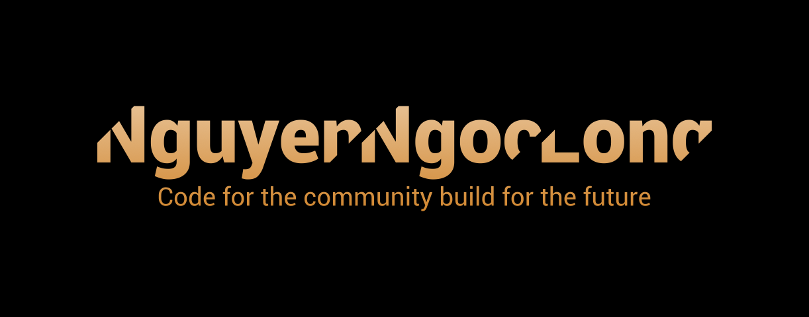

<!-- Visitor -->

<!-- Hello Message -->
<h3 align="center">
    <samp>
        &gt; Hey There!, I am <b><a target="_blank" href="https://nguyenngoclongdev.github.io/">Nguyen Ngoc Long</a></b>
    </samp>
</h3>
&nbsp;

<!-- Profile -->

    <samp>
        I'm a software developer from <b>Vietnam</b> 
        「 Research Assistant & Computer Engineer & Software Developer</b> 」 
    </samp>
     
    <!-- JavaScript -->
    
    <!-- Nodejs -->
    
    <!-- Python -->
    
    <!-- Typescript -->
    
    <!-- Java -->
    
    <!-- C# -->
    

<!-- Repositories -->
&nbsp;
<h2 align="center"><samp>Repositories</samp></h2>

    
    &nbsp;
    

<!-- Stats -->
&nbsp;
<h2 align="center"><samp>Stats & Languages</samp></h2>

    
    &nbsp;
    

<!-- Contribution Graph -->
&nbsp;
<h2 align="center"><samp>Contribution Graph</samp></h2>

<!-- Footer -->
&nbsp;
&nbsp;
<h3 align="center"><samp>Made with ❤️ - 2023.</samp></h3>

